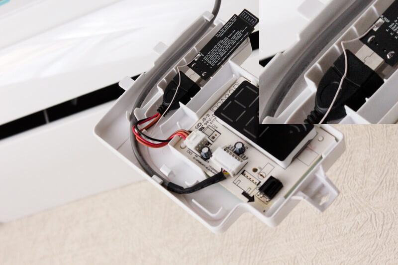

# iot-uni-dongle

An project of universal stick for various IOT appliances controlled via UART.

Main goals
1. Unified design for all types of home devices from different manufacturers.
2. Use of various connectors with a pitch of 2.54 mm and of course USB.
3. Possibility of swapping the middle signal TX/RX contacts.
4. IR transmission and receiving.
5. Minimalistic design: 30.5x19mm (PCB size: 23.5x19mm).
6. Using cheap WiFi module ESP12F based on ESP8266 SoC.

A far from complete list of supported brands:
1. [Midea](https://www.midea.com/)
2. [Electrolux](https://www.electrolux.ru/)
3. [Qlima](https://www.qlima.com/)
4. [Artel](https://www.artelgroup.com/)
5. [Carrier](https://www.carrier.com/)
6. [Comfee](http://www.comfee-russia.ru/)
7. [Inventor](https://www.inventorairconditioner.com/)

## Sockets

## Signal lines TX/RX

## Sending and receiving IR remote control commands

Due to the fact that not all capabilities are implemented in the UART protocol (for example, indication control and `FollowMe` feature), it is possible to sending IR commands by supplying a demodulated signal (duty: 100%) to pin `GPIO13`.
To do this, connect the `IR_TSOP` pad located on the top side of the stick and the output of the TSOP IR demodulator on the display board.
The pictures below show an example for a `TSOP1738` IR receiver.

You can also read the IR signal on the `GPIO12` pin from all remote controls, including third party ones. It can help in researching protocols and various automation goals without resorting to additional devices, thus saving energy.

## Frequently asked Questions:
> How can I tell if my air conditioner is supported or not?

*None 100% answer to the question. But there is a high probability of support if your air conditioner has a USB connector, a regular place for a stick, UART is used.*

> What firmware would you recommend?

*Initially, the stick was developed for [ESPHome](https://esphome.io) and [Home Assistant](https://www.home-assistant.io), but it is possible to write your own firmware for your tasks and needs if you have the appropriate skills.*

> Is it possible to purchase a ready-made stick?

*Yes, you can write me to my [Telegram](https://t.me/dudanov) or [e-mail](mailto:sergey.dudanov@gmail.com).*

If this project was useful to you, you can [buy me](https://paypal.me/dudan0v) a Cup of coffee :)
